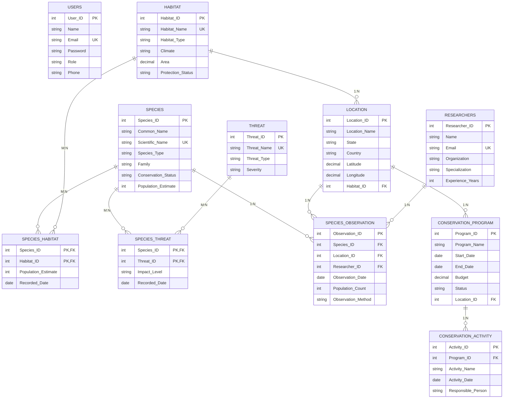

# 🌿 BIODIVERSITY MANAGEMENT SYSTEM (BMS)

> **A Full-Stack Relational Database Management System for Ecological Monitoring, Species Protection, and Conservation Tracking**

---

## 1. Project Title & Overview

**Biodiversity Management System (BMS)** is a comprehensive full-stack web application designed for recording, managing, monitoring, and analyzing biodiversity records. Built to demonstrate core **Database Management System (DBMS) principles**, it enforces a **Third Normal Form (3NF)** relational schema, strict foreign-key integrity, multi-table joins, aggregate analytics, and role-based access control.

Unlike basic CRUD projects, this system represents an authentic environmental data platform integrating species taxonomy, global biomes, scientific field surveys, extinction threat matrices, and state conservation budgets.

---

## 2. Key DBMS Concepts Demonstrated

1. **Relational Database Design**: 11 normalized tables with defined primary and foreign keys.
2. **Third Normal Form (3NF)**: Zero transitive or partial functional dependencies.
3. **Primary Keys & Surrogate Keys**: Uniquely identify entities with auto-incremented primary keys.
4. **Foreign Key Integrity**: Enforced `ON DELETE RESTRICT` and `ON DELETE CASCADE` rules at the database engine level.
5. **One-to-Many Relationships (1:N)**:
   - `Habitat` $\rightarrow$ `Location`
   - `Location` $\rightarrow$ `Conservation_Program`
   - `Conservation_Program` $\rightarrow$ `Conservation_Activity`
   - `Researchers` $\rightarrow$ `Species_Observation`
6. **Many-to-Many Relationships (M:N)**:
   - `Species` $\longleftrightarrow$ `Habitat` (via `Species_Habitat` junction table)
   - `Species` $\longleftrightarrow$ `Threat` (via `Species_Threat` junction table)
7. **Multi-Entity Transaction Tables**:
   - `Species_Observation` relating `Species`, `Location`, and `Researchers` with survey dates, counts, and methods.
8. **Relational Constraints**:
   - `PRIMARY KEY`, `FOREIGN KEY`
   - `UNIQUE` (Scientific Name, Email, Habitat Name, Threat Name)
   - `NOT NULL` (Mandatory entity attributes)
   - `CHECK` constraints (Conservation status, Taxa types, Observation methods, Positive population/budget values)
9. **Complex SQL Queries**: Joins (Inner, Left), Grouping (`GROUP BY`), Aggregation (`COUNT`, `SUM`, `AVG`, `MIN`, `MAX`), Filtering (`WHERE`, `HAVING`, `LIKE`, `IN`), and Subqueries.
10. **Role-Based Access Control (RBAC)**: Distinct permissions for `Admin`, `Researcher`, `Conservation Officer`, and `Viewer`.

---

## 3. Technology Stack

* **Frontend**: React 18, Vite, Lucide Icons, Vanilla Modern CSS Design System (Nature & Forest Palette, Glassmorphism, Responsive Data Tables, Pure SVG Charts).
* **Backend**: Node.js, Express.js, JWT Authentication, Bcrypt.js Password Hashing.
* **Database**:
  * **Relational SQL Database**: Compatible with MySQL 8.x / MariaDB (via `mysql2/promise`) and SQLite (via `better-sqlite3` with `PRAGMA foreign_keys = ON;`).
  * Schema & Seed scripts located in `database/schema.sql` and `database/seed.sql`.

---

## 4. Database Schema & Relational Tables (3NF)

```text
1. Users                   (User_ID PK, Name, Email UNIQUE, Password, Role, Phone, Created_At)
2. Habitat                 (Habitat_ID PK, Habitat_Name UNIQUE, Habitat_Type, Climate, Area, Description, Protection_Status)
3. Location                (Location_ID PK, Location_Name, State, Country, Latitude, Longitude, Habitat_ID FK)
4. Species                 (Species_ID PK, Common_Name, Scientific_Name UNIQUE, Species_Type, Family, Conservation_Status, Population_Estimate, Description, Discovery_Date, Image_Url, Created_At)
5. Species_Habitat         (Species_ID PK/FK, Habitat_ID PK/FK, Population_Estimate, Recorded_Date)  [M:N Junction]
6. Researchers             (Researcher_ID PK, Name, Email UNIQUE, Phone, Organization, Specialization, Experience_Years)
7. Threat                  (Threat_ID PK, Threat_Name UNIQUE, Threat_Type, Severity, Description)
8. Species_Threat          (Species_ID PK/FK, Threat_ID PK/FK, Impact_Level, Recorded_Date, Description)  [M:N Junction]
9. Species_Observation     (Observation_ID PK, Species_ID FK, Location_ID FK, Researcher_ID FK, Observation_Date, Population_Count, Observation_Method, Notes)
10. Conservation_Program   (Program_ID PK, Program_Name, Objective, Start_Date, End_Date, Budget, Status, Location_ID FK)
11. Conservation_Activity  (Activity_ID PK, Program_ID FK, Activity_Name, Activity_Date, Responsible_Person, Description, Outcome)
```

---

## 5. Entity-Relationship (ER) Diagram



---

## 6. Pre-seeded Demo Accounts for Evaluator Testing

You can use the 1-click login buttons on the login/landing page, or enter the credentials below:

| Role | Name | Email | Password | Allowed Capabilities |
| :--- | :--- | :--- | :--- | :--- |
| **Admin** | Dr. Rajesh Sharma | `admin@biodiversity.org` | `Admin@123` | Full CRUD, user management, system reset, custom SQL |
| **Researcher** | Dr. Sunita Narain | `sunita.narain@wii.gov.in` | `Research@123` | Log observations, add/edit species, link threats |
| **Conservation Officer** | Vikram Rathore | `vikram.rathore@forest.gov.in` | `Officer@123` | Manage habitats, locations, programs, and activities |
| **Viewer** | Ananya Iyer | `ananya.iyer@nature.org` | `Viewer@123` | Read-only dashboards, search, profiles, reports |

---

## 7. Installation & Quick Start

### Step 1: Install Dependencies
From the root project directory:
```bash
npm install
npm --prefix client install
```

### Step 2: Configure Environment (`.env`)
A ready-to-use `.env` is already configured:
```env
PORT=5000
NODE_ENV=development
JWT_SECRET=biodiversity_jwt_secret_key_2026_dbms_viva_project

# DATABASE ENGINE SELECTION
# 'sqlite' for zero-config relational SQL with foreign keys (Default)
# 'mysql' for MySQL / XAMPP server
DB_DIALECT=sqlite

# MySQL Settings (if DB_DIALECT=mysql)
DB_HOST=localhost
DB_PORT=3306
DB_USER=root
DB_PASSWORD=
DB_NAME=biodiversity_db
```

### Step 3: Run the Full-Stack Application
Start both Express backend and React Vite frontend concurrently:
```bash
npm run dev
```

* **Frontend Web App**: [http://localhost:5173](http://localhost:5173)
* **Backend API Server**: [http://localhost:5000](http://localhost:5000)

### (Optional) Reseed Database
To reset and re-populate the database with 24+ species, habitats, observations, and programs:
```bash
npm run seed
```

---

## 8. Core SQL Benchmark Queries (DBMS Viva)

The application includes an interactive **DBMS Viva / SQL Lab** that executes the 10 benchmark queries in real time:

1. **Endangered & Critically Endangered Species**: Filtering (`WHERE ... IN`), Sorting (`ORDER BY`).
2. **Species in Specific Habitat**: Junction table 3-table join (`Species` $\rightarrow$ `Species_Habitat` $\rightarrow$ `Habitat`).
3. **Species Count & Total Population per Habitat**: `GROUP BY` and `HAVING` with `COUNT()` and `SUM()`.
4. **Most Frequently Observed Species**: Multi-table aggregation on field transaction logs.
5. **Species Facing Critical Threats**: `JOIN` with composite junction table and predicate filtering.
6. **Taxonomic Population Statistics**: Cumulative, Average, Minimum, and Maximum aggregations.
7. **Researcher Survey Productivity**: `LEFT JOIN` and `COALESCE` aggregation.
8. **Active Conservation Initiatives & Milestone Activities**: 3-table join on State territories.
9. **Habitats with Highest Endangered Species Count**: Multi-condition join and grouped sub-aggregation.
10. **Comprehensive Species Relational Profile**: Simultaneous multiple `LEFT JOIN`s with `COUNT(DISTINCT ...)`.

---

## 9. Project Directory Structure

```text
dbms-project/
├── client/                     # React Frontend
│   ├── src/
│   │   ├── components/         # Header, Sidebar, StatusBadge, StatCard, Charts, SearchModal
│   │   ├── context/            # AuthContext, ToastContext
│   │   ├── pages/              # Landing, Login, Dashboard, Species, Habitats, Locations,
│   │   │                       # Observations, Researchers, Threats, Conservation, Reports,
│   │   │                       # SqlConsole, Settings
│   │   ├── services/           # api.js Centralized HTTP client
│   │   ├── index.css           # Modern Environmental CSS Design System
│   │   ├── App.jsx             # Main router and view switcher
│   │   └── main.jsx
│   ├── index.html
│   └── vite.config.js
│
├── server/                     # Node.js & Express Backend
│   ├── config/
│   │   └── db.js               # Database Adapter (MySQL + SQLite Relational Engine)
│   ├── controllers/            # 10 Dedicated Controllers
│   ├── middleware/             # auth.js JWT & RBAC Authorization
│   ├── routes/                 # api.js Express API routing
│   ├── scripts/                # seed.js Reset and populate utility
│   └── index.js                # Server entry point
│
├── database/                   # Database Assets
│   ├── schema.sql              # Standard 3NF MySQL / ANSI Schema
│   ├── seed.sql                # 24+ Authentic Biological Records & Programs
│   ├── queries.sql             # 10 DBMS Benchmark Viva Queries
│   ├── ER_DIAGRAM.md           # Mermaid ER Diagram & Normalization Analysis
│   └── biodiversity.db         # Pre-initialized Relational Database
│
├── .env                        # Active Environment Variables
├── .env.example
├── package.json
└── README.md
```
