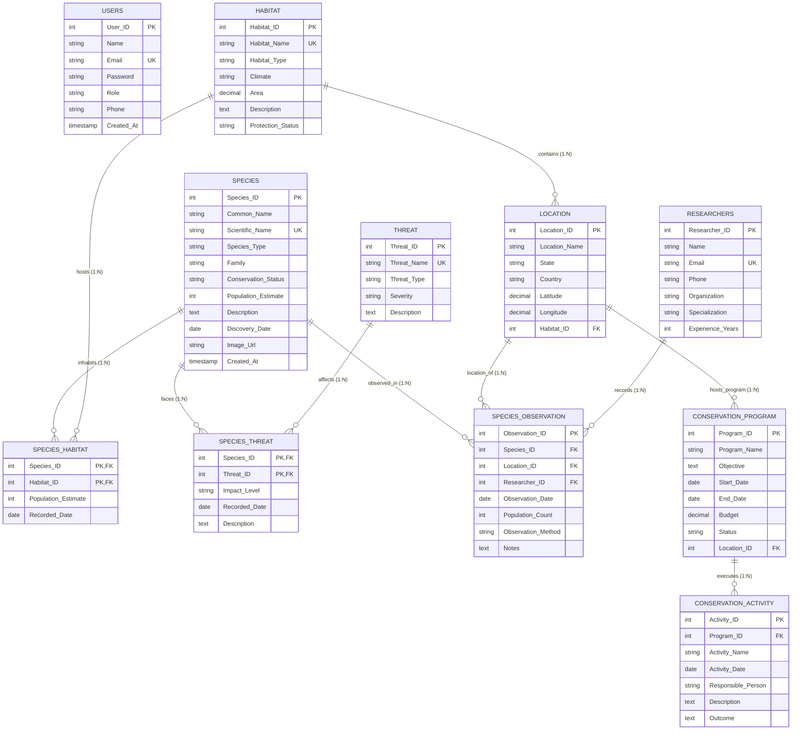

# Biodiversity Management System — Entity-Relationship (ER) Diagram & Schema Documentation

## 1. Relational ER Diagram (Mermaid)

---

## 2. Cardinalities & Relationship Explanations

1. **Species to Habitat (M:N via `Species_Habitat`)**:
   - A single species can inhabit multiple distinct habitats (e.g. Bengal Tiger lives in Tropical Rainforests, Mangroves, and Grasslands).
   - A habitat contains numerous species.
   - Resolved using composite primary key `(Species_ID, Habitat_ID)`.

2. **Species to Threat (M:N via `Species_Threat`)**:
   - A species faces multiple anthropogenic or ecological threats.
   - A threat (e.g., Deforestation) affects many species.
   - Resolved using composite primary key `(Species_ID, Threat_ID)` with extra attributes `Impact_Level` and `Recorded_Date`.

3. **Habitat to Location (1:N)**:
   - Each geographical location belongs to exactly 1 primary habitat zone.
   - One habitat classification encompasses multiple protected sectors/locations.

4. **Species Observation (Multi-Entity Relationship: Species, Location, Researcher)**:
   - Every observation records a specific `Species` seen at a specific `Location` by a specific `Researcher` on a designated date using a standardized observation method.

5. **Conservation Program to Location (1:N)**:
   - A conservation program is hosted within a target geographical territory/location.

6. **Conservation Program to Conservation Activity (1:N)**:
   - A conservation program comprises multiple milestone field activities, audits, patrols, and restoration drives.

---

## 3. Database Normalization Analysis (3NF)

- **1NF (First Normal Form)**:
  - All attributes are atomic (no repeating groups, no comma-separated values).
  - Each record has a designated Primary Key.
- **2NF (Second Normal Form)**:
  - Is in 1NF.
  - No partial dependency. In junction tables `Species_Habitat` and `Species_Threat`, non-key attributes (`Population_Estimate`, `Impact_Level`) depend on the full composite primary key.
- **3NF (Third Normal Form)**:
  - Is in 2NF.
  - No transitive dependency. Non-prime attributes depend ONLY on the primary key, not on other non-prime attributes (e.g., Location names or Habitat details are not duplicated inside Observations).
